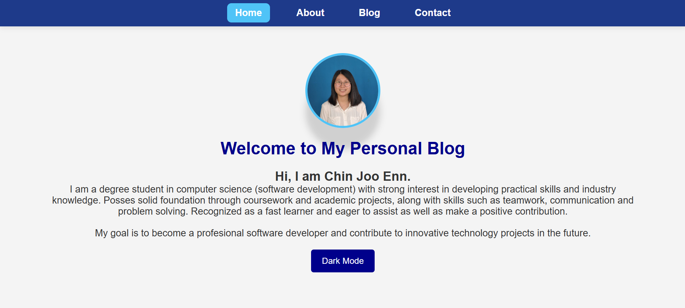
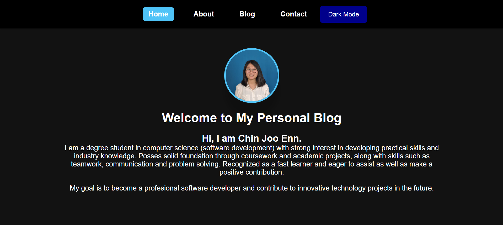

# Personal-blog
Personal Blog Individual Project

## Desciption
This personal blog portfolio website created using HTML, CSS and javascript, which is an individual assignment of subject Special Topics in Software Development.
The website shows my personal profile, education background, hard and soft skills, language, achivement, experience and ways to contact me.

## Features
- Responsive design
- Home page with simple introduction and profile photo
- About Page with education background and skills
- Blog Page with my achivements and experience
- Contact Page with my contact information
- Dark Mode features

## Technologies Used
- HTML
- CSS
- JavaScript

## Screenshot
## Home Page

## About Page
[!About1](images/about_1.png)
[!About2](images/about_2.png)
[!About3](images/about_3.png)

## Blog Page
[!Blog1](images/blog_1.png)
[!Blog2](images/blog_2.png)
[!Blog3](images/blog_3.png)
[!Blog4](images/blog_4.png)

## Contact Page
[!Contact](images/contact.png)

## How to run
Open index.html in browser.

## Demo Link
https://joo-code.github.io/Personal-blog/

